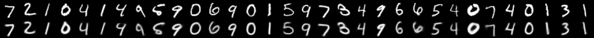
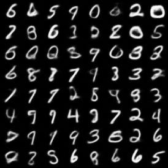

# Báo cáo Assignment 2.1 — Variational Autoencoder (VAE)

## Kết luận

**Bài làm đáp ứng đầy đủ các yêu cầu cốt lõi của Assignment 2.1** với bộ dữ liệu **MNIST**. Mô hình được cài đặt bằng `torch`/`torchvision`, không dùng mô hình VAE có sẵn hay thành phần tiền huấn luyện. Notebook `VAE.ipynb` đã chạy thành công kiểm tra kỹ thuật và huấn luyện 15 epoch trên GPU Tesla T4.

| Hạng mục yêu cầu | Đối chiếu trong bài | Đánh giá |
|---|---|---|
| Encoder: Conv → μ, log(σ²) | `Encoder` có 4 `Conv2d` stride 2; hai head `fc_mu`, `fc_logvar` | Đạt |
| Reparameterization | `std = exp(0.5 * logvar)` và `z = mu + randn_like(std) * std` | Đạt |
| Decoder: deconv → ảnh tái tạo | Linear rồi 4 `ConvTranspose2d`; `Sigmoid` cho đầu ra [0, 1] | Đạt |
| Loss = tái tạo + β·KL | `vae_loss`: BCE hoặc MSE, cộng `beta * kl` | Đạt |
| Dataset MNIST/CelebA | Đã thực nghiệm MNIST 32×32; mã cũng hỗ trợ CelebA 64×64 | Đạt với MNIST |

## Thiết kế mô hình

Thí nghiệm trong notebook dùng MNIST. Ảnh MNIST 28×28 được resize thành 32×32; điều này cần thiết để bốn tầng giảm kích thước theo stride 2 hoạt động cân đối.

```text
x (1×32×32)
  → Conv 1→32 → Conv 32→64 → Conv 64→128 → Conv 128→256
  → flatten (1024)
  → μ (128), log σ² (128)
  → z = μ + ε·exp(0.5·log σ²),  ε ~ N(0, I)
  → Linear (1024) → reshape (256×2×2)
  → Deconv 256→128→64→32→1
  → x̂ (1×32×32)
```

Cấu hình đã chạy: `latent_dim=128`, `base_ch=32`, batch size 128, Adam với learning rate 0.001, `β=1.0`, hàm tái tạo MSE. Tổng số tham số là **1,773,889**.

Hàm mục tiêu được hiện thực đúng dạng:

```math
L = L_{recon} + \beta D_{KL}(q_\phi(z|x)\,\|\,N(0,I))
```

Trong đó phần KL có công thức đóng:

```math
D_{KL} = -\frac{1}{2}\sum_i(1 + \log\sigma_i^2 - \mu_i^2 - \sigma_i^2).
```

Code chia cả reconstruction loss và KL cho batch size sau khi cộng trên pixel/chiều latent, nên hai thành phần được chuẩn hoá nhất quán theo batch.

## Kiểm tra tính đúng đắn

`verify_vae.py`, với đầu vào ngẫu nhiên và không cần tải dataset, đã được chạy trong notebook. Toàn bộ kiểm tra đều PASS:

- Đúng shape cho MNIST (`1×32×32`) và CelebA (`3×64×64`).
- `μ` và `logvar` đúng kích thước `(batch, latent_dim)`; đầu ra tái tạo luôn thuộc [0, 1].
- Loss hữu hạn; tất cả tham số đều nhận gradient hữu hạn.
- Với `μ=0`, `logvar=0`, KL xấp xỉ 0 như lý thuyết.
- Hai lần tái tham số hoá cho mẫu khác nhau; trung bình 2.000 mẫu gần 0.
- Overfit một batch nhỏ: loss giảm từ **115.8724** xuống **1.7013** (giảm trên 90%); MSE pixel cuối là **0.00107** (< 0.01).

Các kết quả này là bằng chứng tốt rằng luồng forward, gradient và công thức loss được cài đặt đúng. Lưu ý: lệnh `python verify_vae.py` không thể chạy lại trong môi trường hiện tại vì executable `python` không có trong `PATH`; nhận định trên dựa vào đầu ra đã lưu trong notebook và việc đọc mã nguồn.

## Kết quả huấn luyện MNIST

Sau 15 epoch, chỉ số trên tập test là:

| Epoch | Test reconstruction (MSE tổng / ảnh) | Test KL | Test loss |
|---:|---:|---:|---:|
| 1 | 21.91 | 11.80 | 33.72 |
| 5 | 15.20 | 12.40 | 27.60 |
| 10 | 14.08 | 12.52 | 26.61 |
| 15 | **13.71** | **12.43** | **26.14** |

Test loss giảm từ 33.72 xuống 26.14 (khoảng 22.5%). Reconstruction loss giảm rõ rệt, còn KL ổn định quanh 12.4; vì vậy không có dấu hiệu posterior collapse. Train loss cuối (26.29) và test loss cuối (26.14) gần nhau, cho thấy chưa có dấu hiệu overfit rõ rệt ở 15 epoch.

### Ảnh tái tạo (epoch 15)

Hàng trên là ảnh gốc, hàng dưới là ảnh tái tạo theo cùng thứ tự. Nét chữ số và lớp số được giữ tốt; một vài nét mảnh/góc cong hơi mờ, điều thường thấy ở VAE dùng MSE.



### Ảnh sinh từ prior (epoch 15)

Mẫu được tạo bằng cách lấy `z ~ N(0, I)` rồi đưa qua decoder. Phần lớn mẫu là chữ số hợp lệ, có độ đa dạng tương đối; một số mẫu vẫn nhòe hoặc khó phân biệt, nên chất lượng sinh ở mức tốt cho 15 epoch cơ bản nhưng còn có thể cải thiện.



## Tệp chính và cách chạy

- `vae.py`: định nghĩa mô hình, loss, dữ liệu, train/evaluate và xuất ảnh/checkpoint.
- `verify_vae.py`: các sanity check độc lập với dataset.
- `VAE.ipynb`: log môi trường, kết quả verify và log train 15 epoch.

```bash
python verify_vae.py
python vae.py --dataset mnist --epochs 15 --batch-size 128 \
  --latent-dim 128 --base-ch 32 --beta 1.0 --recon mse
```


## Đánh giá cuối

VAE đã được xây dựng đúng bằng PyTorch thuần theo rubric, chạy thành công với MNIST và cho reconstruction/mẫu sinh hợp lý. Bài có thể nộp; chỉ nên sửa ghi chú `--download` của CelebA và bổ sung biểu đồ loss nếu muốn báo cáo hoàn chỉnh hơn.
