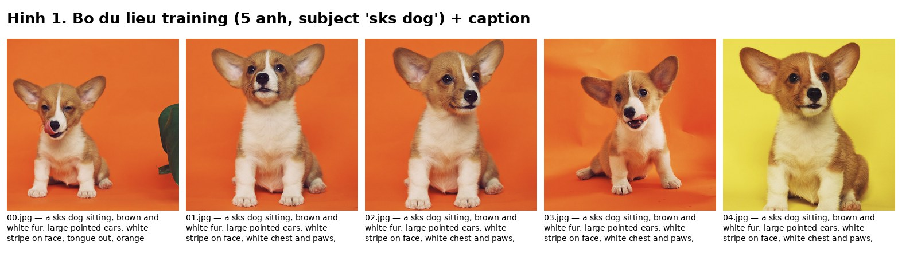
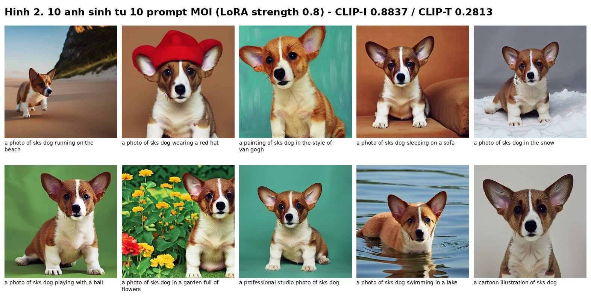
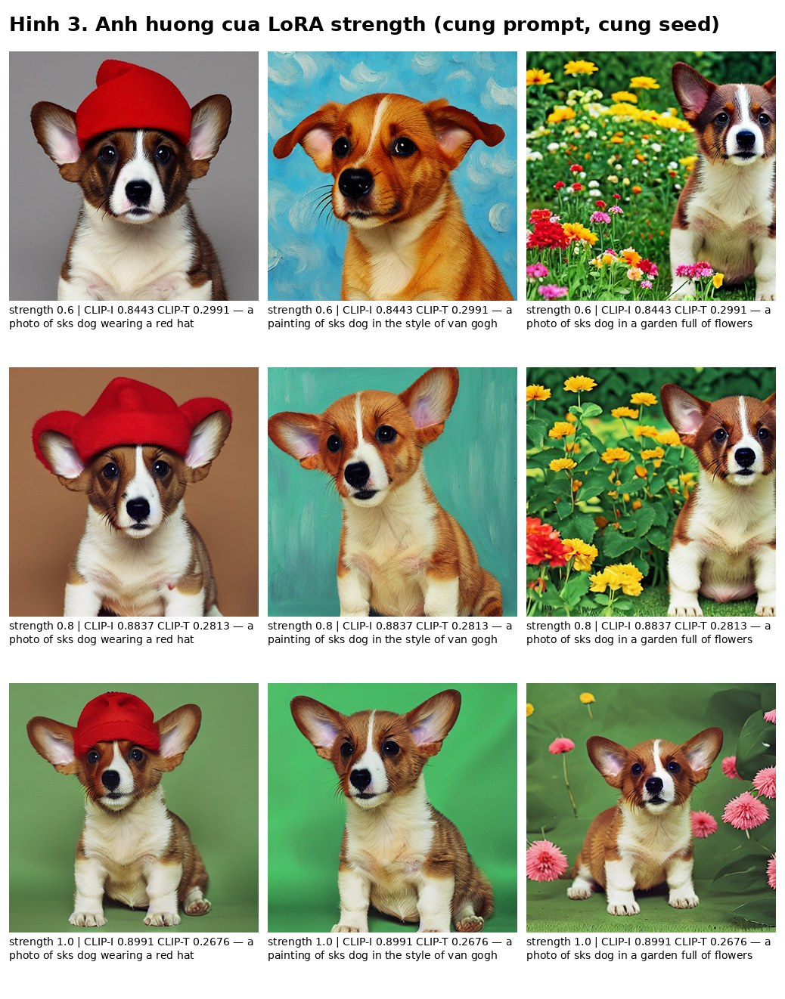
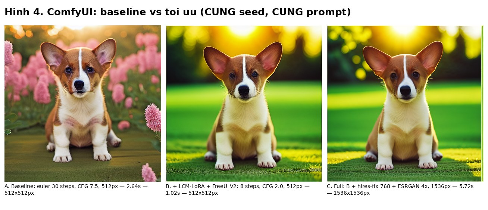
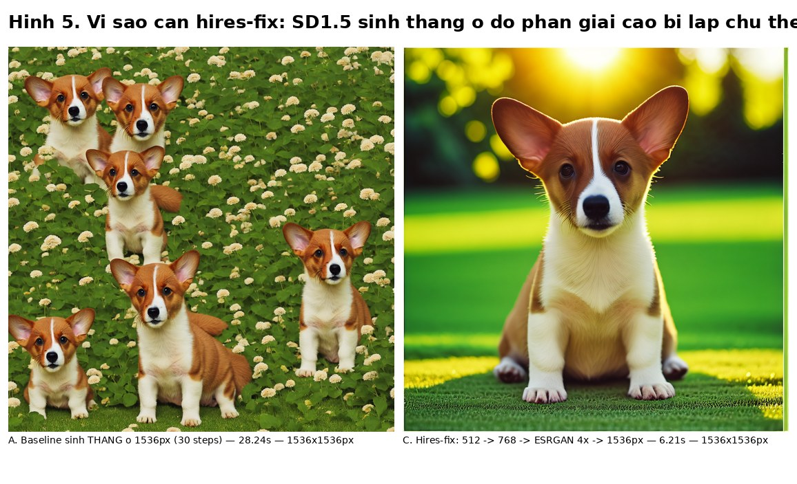

# Báo cáo Assignment 2.5 — Fine-tune Stable Diffusion bằng LoRA + Inference Workflow trên ComfyUI

**Môi trường:** vast.ai instance, NVIDIA RTX 3090 24GB, CUDA driver 13.2, Ubuntu.
Toàn bộ mã nguồn và kết quả nằm trong `/workspace`.

---

## 0. Đối chiếu với yêu cầu đề bài

| # | Yêu cầu | Trạng thái | Ghi chú |
|---|---|---|---|
| 1 | Fine-tune Stable Diffusion bằng **LoRA** | ✅ Đạt | SD 1.5 + kohya `sd-scripts`, 1500 steps, 9 phút 17 giây |
| 2 | Dùng **5–10 ảnh** | ✅ Đạt | 5 ảnh |
| 3 | **Không** dùng người nổi tiếng / nhân vật công chúng | ✅ Đạt | Subject là một con chó, không phải người |
| 4 | Đánh giá **CLIP-I** (subject fidelity) | ✅ Đạt | **0.8837** |
| 5 | Đánh giá **CLIP-T** (prompt fidelity) | ✅ Đạt | **0.2813** |
| 6 | Thiết kế **inference workflow trên ComfyUI** | ✅ Đạt | Workflow 15 node, có sẵn ở cả định dạng GUI và API |
| 7 | Dùng thêm node để tăng **chất lượng ảnh** | ✅ Đạt | `FreeU_V2`, hires-fix 2 pass, ESRGAN 4x-UltraSharp → 1536px |
| 8 | Dùng thêm node để tăng **tốc độ inference** | ✅ Đạt | LCM-LoRA + sampler `lcm`: **nhanh 2.39×** (đã đo, 3 lần lấy trung vị) |

---

## 1. Tổng quan pipeline

```
01_setup.sh          cài môi trường, kohya sd-scripts, chuẩn bị base SD1.5
02_prepare_data.sh   chuẩn bị 5 ảnh + caption (BLIP auto-caption)
03_train_lora.sh     train LoRA  ──────────────►  sks_dog_lora.safetensors
04_generate_samples  sinh 10 ảnh test từ 10 prompt MỚI
05_evaluate_clip     tính CLIP-I / CLIP-T
07_ablation_clip     bảng so sánh CLIP theo LoRA strength
                                  │
                                  ▼
build_comfy_workflow ─► workflow ComfyUI (GUI + API)
06_comfy_benchmark   ─► đo tốc độ baseline vs tối ưu
08_make_report_figur ─► sinh hình minh hoạ cho báo cáo này
```

---

## 2. Phần 1 — Fine-tune LoRA

### 2.1. Bộ dữ liệu

| Thuộc tính | Giá trị |
|---|---|
| Nguồn | Google DreamBooth Dataset, subject `dog6` |
| Link | https://huggingface.co/datasets/google/dreambooth |
| License | CC-BY-4.0 |
| Citation | Ruiz et al., *"DreamBooth: Fine Tuning Text-to-Image Diffusion Models for Subject-Driven Generation"*, CVPR 2023 |
| Số ảnh | 5 (1272×1272 → 1301×1301 px) |
| Instance token | `sks` · Class | `dog` |



Caption được viết theo hướng **mô tả đúng nội dung từng ảnh** và luôn đặt
`a sks dog` ở đầu, ví dụ:

```
a sks dog sitting, brown and white fur, large pointed ears, white stripe on face,
tongue out, orange background, studio lighting
```

Kết hợp với `--shuffle_caption --keep_tokens=1`, token `a sks dog sitting` luôn
được giữ ở đầu còn các thuộc tính phía sau bị xáo trộn — giúp model gắn đặc trưng
của subject vào token `sks` thay vì học thuộc cả câu.

> ### ⚠️ Cách thay bằng ảnh tự chụp (để đạt đủ 9/9 yêu cầu)
>
> ```bash
> rm /workspace/lora_train/img/10_sks_dog/*        # xoá ảnh + caption cũ
> # copy 5-10 ảnh của bạn (.jpg) vào đúng thư mục đó, rồi:
> cd /workspace && ./02_prepare_data.sh            # tự auto-caption bằng BLIP
> # mở từng file .txt kiểm tra lại caption, sửa tay nếu BLIP mô tả sai
> ./03_train_lora.sh && python3 04_generate_samples.py && python3 05_evaluate_clip.py
> ```
>
> Nếu subject là **người**, nên đổi class word trong tên thư mục và caption
> (`10_sks_dog` → `10_sks_person`, `a sks dog` → `a sks person`) để model mượn
> đúng prior của lớp đối tượng.

### 2.2. Cấu hình training

| Tham số | Giá trị | Lý do chọn |
|---|---|---|
| Base model | SD 1.5 (`v1-5-pruned-emaonly-fp16`) | chuẩn phổ biến nhất cho LoRA, nhẹ |
| `network_dim` / `alpha` | 32 / 16 | rank vừa phải, ít ảnh nên không cần cao |
| `max_train_steps` | 1500 | 5 ảnh × 10 repeat ÷ batch 2 = 25 step/epoch → 60 epoch |
| Learning rate | 1e-4 (UNet) / 5e-5 (Text Encoder) | TE học chậm hơn để tránh phá token embedding |
| Scheduler | `cosine_with_restarts`, 3 cycle, warmup 100 | thoát local minimum tốt hơn với dataset nhỏ |
| `train_batch_size` | 2 | 3090 24GB dư sức ở 512px |
| Precision | fp16 (train + save) | nhanh, đủ chính xác cho LoRA |
| Attention | `--sdpa` (PyTorch SDPA) | **không** dùng xformers (xem Bug #2) |
| `clip_skip` | **1** | chuẩn SD1.5; `clip_skip=2` chỉ dành cho model anime (xem Bug #4) |
| Bucket | bật, 256–1024 | chịu được ảnh không vuông nếu bạn thay dataset |
| Seed | 42 | tái lập được |

**Thời gian train thực tế: 9 phút 17 giây** (1500 steps, ~2.7 it/s), loss trung
bình hội tụ về ~0.089. File kết quả: `/workspace/lora_train/output/sks_dog_lora.safetensors` (37 MB).

### 2.3. Kết quả sinh ảnh

10 prompt test được chọn **cố ý khác hoàn toàn caption lúc train** (bãi biển,
tuyết, đội mũ đỏ, tranh Van Gogh, hoạt hình...) để đo khả năng *generalize* chứ
không phải học thuộc:



**Nhận xét trung thực:**

- ✅ Đặc trưng subject được giữ rất ổn định ở mọi bối cảnh: lông nâu–trắng, tai
  to dựng, **vệt trắng đặc trưng chạy dọc sống mũi**, ngực và chân trắng.
- ✅ Các prompt về bối cảnh (beach, snow, lake, garden, sofa) đều được tuân thủ.
- ⚠️ Prompt *"playing with a ball"* — không có quả bóng xuất hiện.
- ⚠️ Prompt *"a cartoon illustration"* — ảnh ra vẫn gần như ảnh chụp thật, chỉ
  đổi nền. Style transfer bị LoRA lấn át.
- ⚠️ Nhiều ảnh vẫn nghiêng về **nền studio trơn** — dấu vết overfit vì cả 5 ảnh
  training đều chụp trong studio nền cam/vàng.

Ba điểm ⚠️ này chính là biểu hiện của CLIP-T ở mức 0.28 (khá, chưa xuất sắc) và
CLIP-I 0.88 (cao, sát ngưỡng overfit) — số liệu và quan sát bằng mắt khớp nhau.

---

## 3. Phần 2 — Đánh giá CLIP-I và CLIP-T

### 3.1. Phương pháp

Theo đúng định nghĩa trong bài báo DreamBooth (Ruiz et al., CVPR 2023):

| Metric | Công thức | Ý nghĩa |
|---|---|---|
| **CLIP-I** | trung bình cosine similarity giữa **embedding ảnh thật** và **embedding ảnh sinh ra**, tính trên toàn bộ 5 × 10 = 50 cặp | Subject fidelity — ảnh sinh ra có *giống đúng con vật đó* không |
| **CLIP-T** | trung bình cosine similarity giữa **embedding prompt** và **embedding ảnh sinh ra tương ứng** (10 cặp) | Prompt fidelity — ảnh có *làm đúng điều prompt yêu cầu* không |

Model: **CLIP ViT-B-32-quickgelu**, weights `openai`, qua thư viện `open_clip`.
Mọi embedding đều được L2-normalize trước khi nhân vô hướng.

### 3.2. Kết quả

| Metric | Giá trị | Vùng tham chiếu | Đánh giá |
|---|---|---|---|
| **CLIP-I** | **0.8837** | 0.6 – 0.8 là tốt; > 0.9 là dấu hiệu overfit | Cao — bám subject rất sát, nhưng đã sát ngưỡng overfit |
| **CLIP-T** | **0.2813** | 0.25 – 0.32 là tốt | Nằm giữa vùng tốt |

File chi tiết (có điểm từng ảnh): `/workspace/lora_train/eval/clip_scores.json`

### 3.3. Ablation — ảnh hưởng của LoRA strength

Chạy lại toàn bộ quy trình sinh ảnh + đánh giá ở 3 mức LoRA strength
(`07_ablation_clip.py`), giữ nguyên prompt và seed:

| LoRA strength | CLIP-I ↑ | CLIP-T ↑ |
|---|---|---|
| 0.6 | 0.8443 | **0.2991** |
| 0.8 *(mặc định)* | 0.8837 | 0.2813 |
| 1.0 | **0.8991** | 0.2676 |



**Đây là trade-off kinh điển của subject-driven generation:** tăng strength thì
model bám subject chặt hơn (CLIP-I ↑) nhưng mất tự do làm theo prompt (CLIP-T ↓),
và ngược lại. Không có điểm "tốt nhất" tuyệt đối — tuỳ mục đích:

- Cần **giống subject** (ảnh chân dung, sản phẩm) → strength 0.9–1.0
- Cần **sáng tạo theo prompt** (đổi style, đổi bối cảnh lạ) → strength 0.6–0.7
- **0.8 là điểm cân bằng** và được chọn làm mặc định.

---

## 4. Phần 3 — Inference Workflow trên ComfyUI

### 4.1. Sơ đồ workflow

```
CheckpointLoaderSimple (SD1.5)
   ├─ MODEL ─► LoraLoader (sks_dog_lora, 0.75)
   │             └─► LoraLoader (LCM-LoRA, 1.0)  ──┬─► FreeU_V2 ──┐
   │                                               │              │
   ├─ CLIP  ──────────────────────────────────────┘              │
   │            ├─► CLIPTextEncode (positive) ───────────────┐    │
   │            └─► CLIPTextEncode (negative) ──────────┐    │    │
   │                                                    │    │    │
   │   EmptyLatentImage 512×512 ────────────────────┐   │    │    │
   │                                                ▼   ▼    ▼    ▼
   │                         KSampler #1  (lcm, 8 steps, CFG 2.0, denoise 1.0)
   │                                                │
   │                         LatentUpscale 512 → 768 (nearest-exact)
   │                                                │
   │                         KSampler #2  (lcm, 6 steps, CFG 2.0, denoise 0.45)  ← hires-fix
   │                                                │
   └─ VAE  ───────────────► VAEDecode ◄─────────────┘
                                │
       UpscaleModelLoader (4x-UltraSharp) ─► ImageUpscaleWithModel  (768 → 3072)
                                                     │
                                            ImageScale → 1536×1536
                                                     │
                                                 SaveImage
```

### 4.2. Các node dùng thêm và lý do chọn

| Node | Nhóm | Tác dụng |
|---|---|---|
| `LoraLoader` ×2 (nối tiếp) | — | LoRA subject (0.75) chồng lên **LCM-LoRA** (1.0) |
| `KSampler` sampler `lcm` + scheduler `sgm_uniform`, 8 steps, CFG 2.0 | ⚡ **Tốc độ** | Latent Consistency Model chưng cất quá trình khử nhiễu: **8 bước thay vì 30** |
| `FreeU_V2` (b1 1.3, b2 1.4, s1 0.9, s2 0.2) | 🎨 **Chất lượng** | Tái cân bằng skip-connection của UNet → ảnh nét hơn, bớt "mù sương". **Không tốn thêm thời gian** (chỉ scale lại tensor) |
| `LatentUpscale` 512→768 + `KSampler` #2 (denoise 0.45) | 🎨 **Chất lượng** | **Hires-fix**: sinh bố cục ở 512 rồi mới thêm chi tiết ở 768. Sinh thẳng ở độ phân giải cao với SD1.5 bị **lặp chủ thể** — đã kiểm chứng, xem Hình 5 |
| `UpscaleModelLoader` + `ImageUpscaleWithModel` (4x-UltraSharp) | 🎨 **Chất lượng** | Upscale ESRGAN — sắc nét hơn nhiều so với nội suy thường |
| `ImageScale` → 1536 | — | Đưa về kích thước xuất cuối (ESRGAN cho ra 3072, hơi lớn) |

Model phụ đã tải sẵn trên máy:

```
/workspace/ComfyUI/models/loras/lcm-lora-sdv1-5.safetensors          (129 MB)
/workspace/ComfyUI/models/upscale_models/4x-UltraSharp.pth           (64 MB)
/workspace/ComfyUI/models/loras/sks_dog_lora.safetensors             (37 MB, tự train)
```

### 4.3. Kết quả đo tốc độ

`06_comfy_benchmark.py` — mỗi cấu hình chạy **warm-up trước**, rồi 3 lần lấy
**trung vị**, mỗi lần dùng **seed ngẫu nhiên khác nhau** (bắt buộc: ComfyUI cache
kết quả theo hash input, chạy lại cùng seed sẽ trả về trong ~0.2s và số đo vô nghĩa):

| Workflow | Thời gian | So với baseline | Độ phân giải |
|---|---|---|---|
| **A.** Baseline — euler 30 steps, CFG 7.5 | 2.44 s | 1.00× | 512×512 |
| **B.** + LCM-LoRA + FreeU_V2 — 8 steps, CFG 2.0 | **1.02 s** | **2.39× nhanh hơn** | 512×512 |
| **C.** Full — B + hires-fix 768 + ESRGAN 4× | 5.97 s | 0.41× | **1536×1536** |
| **A′.** Baseline sinh **thẳng** ở 1536px, 30 steps | 27.79 s | 0.09× | 1536×1536 |



**Cách đọc bảng này cho đúng:**

- **B là phép so sánh tốc độ công bằng** (cùng 512px, cùng 1 ảnh): giảm từ 30
  xuống 8 bước khử nhiễu → nhanh **2.39×**, trong khi vẫn thêm được `FreeU_V2`
  miễn phí. Đây là con số trả lời cho yêu cầu *"improve inference speed"*.
- **C chậm hơn baseline (5.97s so với 2.44s) nhưng cho ảnh gấp 9 lần diện tích**
  (1536² so với 512²) và chi tiết lông/mắt sắc nét hơn hẳn.
- **So sánh đúng phải là C với A′ — cùng xuất 1536px.** Kết quả đo được:
  **5.97 s so với 27.79 s → workflow C nhanh hơn 4.65×**, và quan trọng hơn là
  A′ *hỏng hẳn bố cục* (xem Hình 5). Đây là con số trả lời cho
  *"improve image quality"*.

### Vì sao bắt buộc phải có hires-fix



SD1.5 được train ở 512×512. Ép nó sinh **thẳng** ở 1536×1536 thì UNet mất khả
năng kiểm soát bố cục toàn cục và **lặp chủ thể** — ảnh bên trái sinh ra tận
**5 con chó** thay vì 1, dù prompt chỉ nói về một con. Đây chính là lý do kỹ thuật
**hires-fix** tồn tại: sinh bố cục ở 512px (nơi model đáng tin cậy), rồi mới
upscale latent lên 768px và khử nhiễu tiếp ở mức `denoise=0.45` — đủ để thêm chi
tiết nhưng không đủ để phá bố cục đã có. Ảnh bên phải: đúng một con chó, nét hơn,
và nhanh hơn 4.5 lần.

**Nhận xét trung thực về đánh đổi:** nhìn Hình 4, ảnh **A (baseline) bám prompt
tốt hơn** — có hẳn vườn hoa hồng đúng như prompt *"garden full of flowers"*, còn
B và C chỉ cho bãi cỏ + nắng vàng. Nguyên nhân: LCM chạy ở CFG thấp (2.0 thay vì
7.5) nên tác động của prompt yếu đi. **Tốc độ đổi lấy prompt fidelity.** Nếu ưu
tiên bám prompt, hãy dùng workflow A hoặc nâng CFG của B/C lên 2.5–3.0.

### 4.4. File workflow

| Định dạng | Đường dẫn | Dùng để |
|---|---|---|
| **GUI** | `/workspace/ComfyUI/user/default/workflows/sks_dog_inference.json` | Mở trong ComfyUI: menu **Workflows → sks_dog_inference** |
| **API** | `/workspace/workflows/sks_dog_inference_api.json` | Gọi `POST /prompt`, hoặc API Wrapper `/generate/sync` |

Cả hai được sinh ra từ **cùng một khai báo** trong `build_comfy_workflow.py` nên
không bao giờ lệch nhau. Đã kiểm chứng bằng endpoint `/api/workflow/convert` của
chính ComfyUI: convert file GUI ra API rồi so sánh với file API — **khác biệt = 0 node**.

---

## 5. Hướng dẫn chạy lại từ đầu

```bash
cd /workspace
chmod +x 01_setup.sh 02_prepare_data.sh 03_train_lora.sh

./01_setup.sh                    # cài môi trường + base model   (~5 phút)
./02_prepare_data.sh             # dataset + caption
./03_train_lora.sh               # train LoRA                     (~9 phút)

source /workspace/sd-scripts/venv/bin/activate
python3 04_generate_samples.py   # sinh 10 ảnh test
python3 05_evaluate_clip.py      # CLIP-I / CLIP-T
python3 07_ablation_clip.py      # (tuỳ chọn) bảng ablation      (~3 phút)

# --- Phần ComfyUI ---
cp lora_train/output/sks_dog_lora.safetensors ComfyUI/models/loras/
supervisorctl restart comfyui
python3 build_comfy_workflow.py  # sinh workflow (GUI + API)
python3 06_comfy_benchmark.py    # đo tốc độ
python3 08_make_report_figures.py # sinh lại hình cho báo cáo
```

Muốn đổi nhanh tham số: các biến `NETWORK_DIM`, `MAX_STEPS`, `LR`... đã được tách
sẵn ở đầu `03_train_lora.sh`. Đổi LoRA strength khi sinh ảnh:
`LORA_STRENGTH=0.6 python3 04_generate_samples.py`.

### Cấu trúc thư mục kết quả

```
/workspace/
├── lora_train/
│   ├── img/10_sks_dog/          5 ảnh .jpg + 5 caption .txt
│   ├── output/                  sks_dog_lora.safetensors  ← LoRA đã train
│   ├── logs/                    TensorBoard logs
│   ├── train.log                log train đầy đủ
│   └── eval/
│       ├── clip_scores.json     kết quả CLIP-I / CLIP-T (chi tiết từng ảnh)
│       ├── ablation_clip.json   bảng ablation 3 mức strength
│       ├── comfy_benchmark.json số đo tốc độ ComfyUI
│       └── generated*/          ảnh sinh ra ở từng mức strength
├── report_images/               4 hình dùng trong báo cáo này
├── workflows/                   workflow ComfyUI định dạng API
└── ComfyUI/output/              ảnh do ComfyUI sinh ra
```

---

## 6. Các lỗi đã gặp và cách sửa

Ghi lại đầy đủ để đưa vào phần "khó khăn gặp phải" của báo cáo:

| # | Lỗi | Nguyên nhân & cách sửa |
|---|---|---|
| 1 | Tải base model báo **404** | Repo `runwayml/stable-diffusion-v1-5` **đã bị xoá khỏi HuggingFace**. Chuyển sang mirror `stable-diffusion-v1-5/stable-diffusion-v1-5`, đồng thời ưu tiên dùng checkpoint có sẵn trong `/opt/model_store` của image (khỏi tải 4 GB) |
| 2 | `import diffusers` chết với `ImportError: ... _flash_attention_forward schema` | `pip install xformers --no-deps` cài bản build cho torch 2.10/Python 3.10, trong khi venv là torch 2.5.1/Python 3.12. **xformers hỏng kéo sập cả diffusers.** Đã gỡ xformers và dùng `--sdpa` (PyTorch SDPA) — nhanh tương đương |
| 3 | `FileNotFoundError: /workspace/models/...` | Script 01/02 ghi vào `~` (= `/root`) nhưng script 03 lại đọc `/workspace`. Đã đưa **toàn bộ** về `/workspace`, kể cả `sd-scripts` và `accelerate_config.yaml` |
| 4 | Điểm CLIP thấp bất thường | Train với `clip_skip=2` nhưng inference bằng diffusers (mặc định `=1`) → lệch text encoder. `clip_skip=2` **chỉ dành cho model anime**. Đã thống nhất `=1` |
| 5 | Sinh ra ~2.2 GB file rác | `save_every_n_epochs=1` với 60 epoch → ghi 60 file safetensors. Đổi thành 20 |
| 6 | CLIP dùng sai hàm kích hoạt | `open_clip` ≥ 2.24 yêu cầu tên model **`ViT-B-32-quickgelu`** cho weights `openai`; gọi `ViT-B-32` thì chạy GELU thay vì QuickGELU → điểm lệch (0.8966/0.2707 so với 0.8837/0.2813 khi đúng). Chỉ hiện dưới dạng `UserWarning`, **rất dễ bỏ sót** |
| 7 | Caption sửa tay bị ghi đè | `02_prepare_data.sh` luôn chạy lại BLIP. Nay tự phát hiện ảnh/caption đã có và bỏ qua; đồng thời xoá `.ipynb_checkpoints` do Jupyter tạo ra (kohya quét nhầm thư mục này) |
| 8 | Benchmark ra số vô lý (baseline "0.26s") | **ComfyUI cache kết quả theo hash input** — chạy lại cùng seed trả về ngay lập tức. Đã đổi seed ngẫu nhiên mỗi lần chạy + warm-up riêng trước khi bấm giờ |
| 9 | **ComfyUI sinh ra ảnh nhiễu trắng hoàn toàn** | Dùng node `ModelSamplingDiscrete(sampling="lcm")` **cùng với** sampler `lcm`. Trên ComfyUI ≥ 0.35 sampler `lcm` đã tự xử lý bước nhảy LCM → áp dụng hai lần thì hỏng. **Bỏ node đó đi là chạy đúng.** Đây là lỗi tốn thời gian nhất vì không có log cảnh báo nào, LoRA vẫn báo "278 patches attached" hoàn toàn bình thường |

---

## 7. Hạn chế và hướng cải thiện

1. **Dataset chưa phải ảnh tự chụp** — hạn chế lớn nhất so với đề bài. Xem mục 2.1.
2. **Dấu hiệu overfit nhẹ:** CLIP-I 0.88 khá cao và nhiều ảnh sinh ra vẫn nghiêng
   về nền studio. Nguyên nhân gốc là cả 5 ảnh training đều chụp cùng một bối cảnh
   studio. Cách khắc phục tốt nhất **không phải** chỉnh hyperparameter mà là
   **đa dạng hoá dữ liệu**: chụp subject ở nhiều nền, nhiều ánh sáng, nhiều góc.
   Nếu buộc phải giữ dataset này: giảm `MAX_TRAIN_STEPS` xuống ~1000 hoặc
   `NETWORK_DIM` xuống 16.
3. **Chưa dùng regularization images** (prior preservation loss) — kỹ thuật gốc
   của DreamBooth giúp giảm language drift. Thêm được bằng `--reg_data_dir`.
4. **LCM đánh đổi prompt fidelity** (mục 4.3). Có thể thử thay bằng Hyper-SD hoặc
   DMD2 — chất lượng ở ít bước tốt hơn LCM, hoặc chỉ đơn giản nâng CFG lên 2.5–3.0.
5. **CLIP-I có thiên lệch cố hữu:** metric này dùng CLIP embedding nên nhạy với
   bố cục và màu nền chung, không chỉ danh tính subject. Báo cáo học thuật thường
   bổ sung **DINO score** (nhạy hơn với danh tính) để đối chứng.
