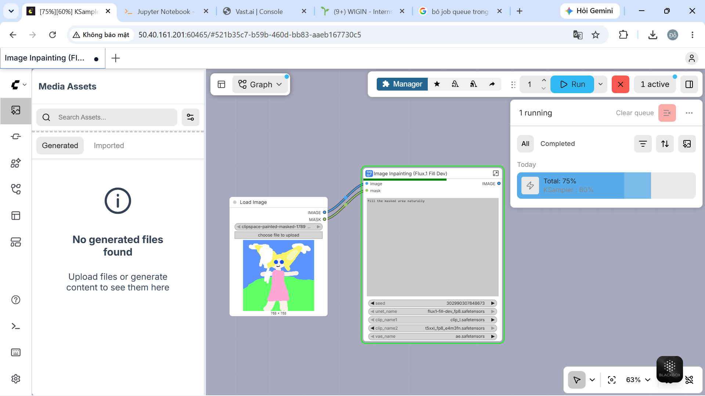
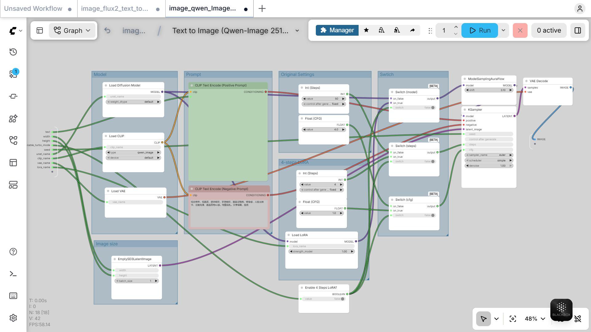
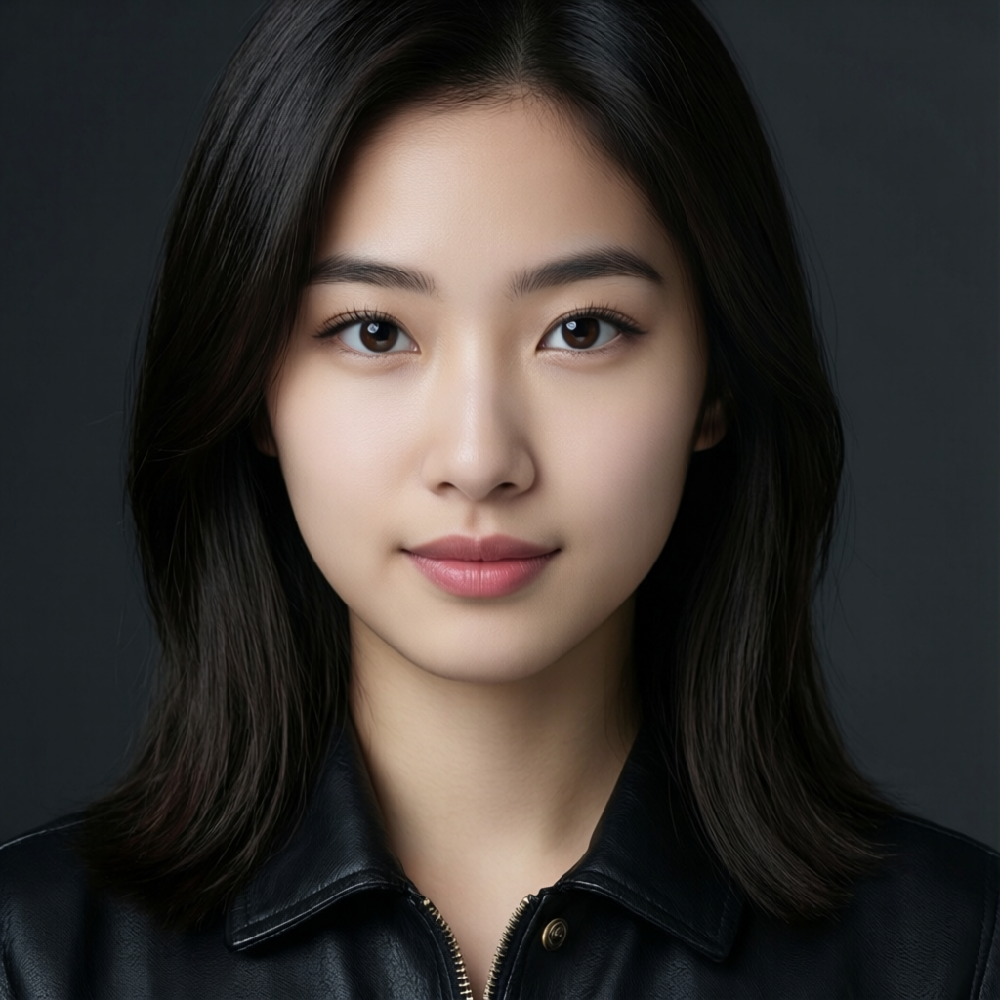

# Assignment 2.8 — Thiết kế workflow suy luận ảnh với ComfyUI

## 1. Mục tiêu

Bài thực hành xây dựng và chạy các workflow suy luận (inference) trong **ComfyUI** cho các mô hình có trong thư mục bài nộp:

- **Flux.1 Fill Dev**: inpainting, tức tái tạo vùng được che (mask) trên ảnh đầu vào.
- **Qwen-Image 2512**: text-to-image, có tuỳ chọn chạy nhanh bằng 4-step LoRA.

Mục tiêu là nắm được đường đi của dữ liệu từ prompt/ảnh đầu vào, mô hình và latent đến sampler, VAE decode và ảnh kết quả; đồng thời biết thay đổi các tham số suy luận cơ bản.

## 2. Môi trường và thành phần chung

- Giao diện thực hiện: **ComfyUI**.
- Các node chính: `Load Diffusion Model`, `Load CLIP`, `Load VAE`, `CLIP Text Encode`, `KSampler`, `VAE Decode`, `Save Image`.
- Các tham số được điều chỉnh: `seed`, `steps`, `CFG`, `sampler`, `scheduler`, `denoise`, độ rộng và chiều cao ảnh.

> Tên checkpoint/encoder/VAE phụ thuộc vào các model đã cài trong thư mục ComfyUI của máy chạy. Chọn đúng bộ model tương ứng với workflow trước khi nhấn **Run**.

## 3. Workflow 1 — Flux.1 Fill Dev (Inpainting)

### Mục đích

Workflow này dùng để thay thế hoặc hoàn thiện một vùng trong ảnh. Ảnh gốc và mask được nạp từ node `Load Image`; phần màu trắng trong mask là khu vực cần tạo lại.

### Luồng suy luận

```text
Load Image (image + mask)
        │
Load Diffusion Model / Load CLIP (Dual) / Load VAE
        │
CLIP Text Encode → FluxGuidance → InpaintModelConditioning
        │                                  │
Conditioning Zero Out ─────────────────────┘
        │
KSampler → VAE Decode → Save Image
```

`InpaintModelConditioning` nhận positive conditioning, negative conditioning, VAE, ảnh và mask để tạo latent phục vụ inpainting. `Conditioning Zero Out` cung cấp nhánh negative conditioning. Sau đó `KSampler` khử nhiễu latent, `VAE Decode` chuyển latent thành ảnh RGB và `Save Image` lưu kết quả.

### Cấu hình đã dùng

| Thành phần | Giá trị quan sát được |
| --- | --- |
| UNet | `flux1-fill-dev_fp8.safetensors` |
| CLIP 1 | `clip_l.safetensors` |
| CLIP 2 | `t5xxl_fp8_e4m3fn.safetensors` |
| VAE | `ae.safetensors` |
| Flux guidance | 30.0 |
| Steps | 20 |
| CFG | 1.0 |
| Sampler | Euler |
| Scheduler | Normal |
| Denoise | 1.0 |
| Kích thước ảnh | 768 × 768 |

Prompt thử nghiệm: `fill the masked area naturally`.

### Bằng chứng thực hiện

Ảnh đầu vào/mask:


Ảnh kết quả sau inpainting:


Tổng quan workflow và các node:



.png)

.png)

## 4. Workflow 2 — Qwen-Image 2512 (Text-to-Image)

### Mục đích

Workflow sinh ảnh từ mô tả văn bản bằng Qwen-Image. Workflow hỗ trợ hai cấu hình suy luận:

1. **Cấu hình thường**: `steps = 50`, `CFG = 4.0`.
2. **4-step LoRA**: bật `Enable 4 Steps LoRA?`, nạp LoRA và chuyển bằng các node `Switch`; khi đó dùng `steps = 4`, `CFG = 1.0` để tăng tốc.

### Luồng suy luận

```text
Load Diffusion Model + Load CLIP + Load VAE
                 │
Prompt / Negative Prompt → CLIP Text Encode
                 │
EmptySD3LatentImage ───────────────┐
Load LoRA (tuỳ chọn) → Switch ─────┼→ KSampler
Steps / CFG → Switch ──────────────┘     │
                                 ModelSamplingAuraFlow
                                           │
                                      VAE Decode → ảnh kết quả
```

`EmptySD3LatentImage` tạo latent theo kích thước ảnh mong muốn. Các node `Switch` lựa chọn model, số bước và CFG tương ứng khi có hoặc không dùng 4-step LoRA. `ModelSamplingAuraFlow` áp dụng tham số `shift = 3.10` trước khi VAE decode.

### Cấu hình quan sát được

| Tham số | Cấu hình thường | 4-step LoRA |
| --- | ---: | ---: |
| Steps | 50 | 4 |
| CFG | 4.0 | 1.0 |
| Sampler | Euler | Euler |
| Scheduler | Simple | Simple |
| Denoise | 1.0 | 1.0 |
| Shift | 3.10 | 3.10 |

### Bằng chứng thực hiện



Kết quả sinh ảnh Qwen-Image (1024 × 1024):



## 5. Cách tái lập kết quả

1. Khởi động ComfyUI và bảo đảm checkpoint, text encoder, VAE (cùng LoRA nếu dùng) đã được cài đúng vị trí.
2. Mở workflow phù hợp: `Image Inpainting (Flux.1 Fill Dev)` hoặc `Text to Image (Qwen-Image 2512)`.
3. Chọn các model trong node tải model; nhập prompt và, nếu áp dụng, negative prompt.
4. Với Flux.1, nạp ảnh chứa mask; với Qwen-Image, đặt chiều rộng/cao và chọn có/không dùng 4-step LoRA.
5. Đặt `seed` cố định nếu cần tái lập chính xác, sau đó nhấn **Run**.
6. Kiểm tra ảnh ở node `Save Image` và lưu output.

## 6. Kết luận

Hai workflow minh hoạ hai nhu cầu suy luận phổ biến trong ComfyUI: **inpainting có mask** với Flux.1 và **text-to-image có lựa chọn tối ưu tốc độ** với Qwen-Image. Việc tách phần tải model, mã hoá prompt, tạo conditioning/latent, sampling và giải mã VAE giúp workflow dễ kiểm tra, thay đổi tham số và tái sử dụng.
